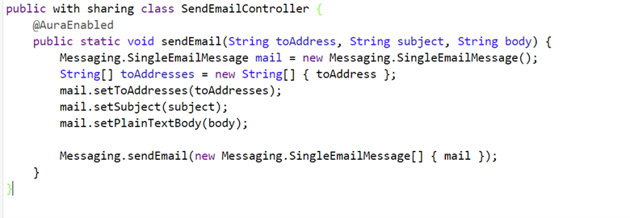

# WorkoutLogger App

Welcome to the WorkoutLogger app! This project is built on Salesforce technology and offers both web and mobile interfaces to help users track their fitness progress efficiently. With the WorkoutLogger app, users can log workouts, monitor progress over time, and stay motivated to achieve their fitness goals.

## Features

### Core Features
- **Aura Components:** The app leverages Salesforce's Aura Components to create dynamic and responsive user interfaces.
- **Process Automation:** WorkoutLogger uses Process Builder for automated workflow actions, ensuring seamless data management.
- **Apex Controllers:** Custom Apex code manages the business logic, providing robust backend operations.
- **Custom Objects:** Workouts and progress are stored in Salesforce as custom objects, allowing for a flexible and scalable data structure.
- **Master-Detail Relationships:** Relationships between objects are established using master-detail fields for easy roll-up summary calculations.
- **Experience Cloud:** The app is accessible through Salesforce Experience Cloud, allowing external users to interact with the app via a branded community.

## Technologies Used
- **Frontend:** Aura Components
- **Backend:** Apex (custom logic)
- **Database:** Salesforce Custom Objects
- **Automation:** Salesforce Process Builder
- **Deployment:** Salesforce Experience Cloud for web and mobile access

## Installation

Since the WorkoutLogger app is built on Salesforce, follow these steps to set up and deploy the app:

### Prerequisites
- Salesforce Developer Org with My Domain enabled
- Experience in Salesforce Aura, Apex, and Process Builder

### Installation Steps
1. **Clone the repository:**
   ```bash
   git clone https://github.com/your-username/workoutlogger.git
   ```
2. **Deploy to Salesforce:**
   - Use Salesforce CLI or your preferred deployment tool (e.g., Change Sets, Unlocked Packages).
   - Ensure that all custom objects, fields, and relationships are properly configured.
   - Deploy Aura components and Apex classes to your Salesforce org.
3. **Set Up Experience Cloud:**
   - Create a new Experience Site and configure it to use the deployed Aura components.
   - Customize the site for your branding needs and activate it for your users.
4. **Configure Process Builder:**
   - Set up Process Builder to automate workout logging processes and notifications.

## Screenshots

Here are some screenshots of the app in action:

- **Apex Screenshot**:  
  

- **Lightning Component Screenshots**:  
    
    
    
  

- **Mobile Screenshots**:  
    
    
  

- **Web Screenshots**:  
    
    
    
  

## Contributing
We welcome contributions! If you'd like to contribute, feel free to submit issues or pull requests for improvements.

## License
This project is licensed under the MIT License - see the [LICENSE](LICENSE) file for details.
